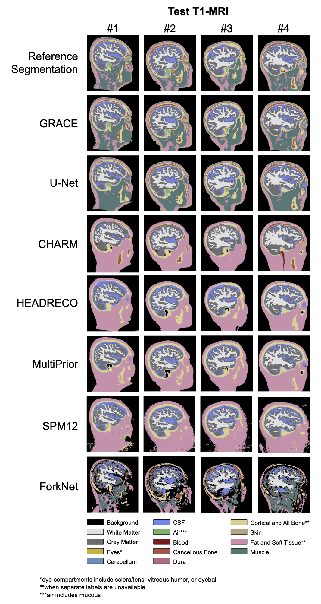
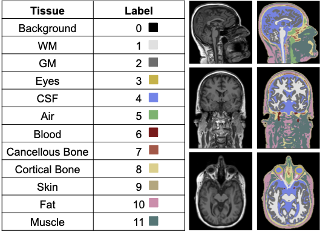

# 🧠 GRACE: General, Rapid, And Comprehensive whole-hEad tissue segmentation

Precise and rapid whole-head tissue segmentation for older adult T1-weighted MRI. GRACE segments 11 tissue types (white matter, grey matter, eyes, cerebrospinal fluid, air, blood vessel, cancellous bone, cortical bone, skin, fat, muscle) with favorable accuracy and speed. It requires only the input T1 MRI and includes its own preprocessing pipeline—no external neuroimaging preprocessing needed.

- Paper: Precise and Rapid Whole-Head Segmentation from Magnetic Resonance Images of Older Adults using Deep Learning
- Code: Official implementation for training and using GRACE
- Pretrained model: Optimized for older adult heads to enable high-precision modeling in age-related brain disorders
- Dataset: Trained/validated on 177 manually corrected MR-derived segmentations, each thoroughly reviewed
## Citation
If you use this code, please cite:
```
@InProceedings{stolte2024,
  author="Stolte, Skylar E. and Indahlastari, Aprinda and Chen, Jason and Albizu, Alejandro and Dunn, Ayden and Pederson, Samantha and See, Kyle B. and Woods, Adam J. and Fang, Ruogu",
  title="Precise and Rapid Whole-Head Segmentation from Magnetic Resonance Images of Older Adults using Deep Learning",
  booktitle="Imaging NeuroScience",
  year="2024",
  url="TBD"
}
```

## Major Results
- Segments 11 tissues from T1 MRIs with high accuracy and fast processing.
- Contains its own preprocessing pipeline—no external neuroimaging tools required.
- Average Hausdorff Distance: 0.21 (vs. runner-up 0.36).
- Representative pretrained models available; particularly useful for older adult head MRIs.

<p align="center">
  
</p>
<p align="center"><em>Figure 1: Tissue label map — labels are numerically encoded (e.g., 1 = white matter).</em></p>

<p align="center">
  
</p>
<p align="center"><em>Figure 2: GRACE vs. common segmentation methods on four MRI head volumes.</em></p>

## 📥 Downloads and Releases
Latest release: v1.0.1 — https://github.com/lab-smile/GRACE/releases/tag/v1.0.1
Assets:
- GRACE_MONAI081.pth — pretrained model for MONAI 0.8.1 (original paper code)
- GRACE_MONAI150.pth — pretrained model for MONAI 1.5.0 (latest as of Sep 2025)
- Source code (zip)
- Source code (tar.gz)

Note: Checksums and file sizes are listed on the release page. Choose the .pth that matches your MONAI version.

## 🔗 Quick Links
- Paper (PubMed): https://pubmed.ncbi.nlm.nih.gov/38465203/
- Base model (MONAI UNETR): https://github.com/Project-MONAI/research-contributions/tree/main/UNETR
- GRACE CLI: https://github.com/lab-smile/grace-cli
- Demo video: https://www.youtube.com/watch?v=0YU7Yd-mK2g&feature=youtu.be

## GRACE CLI (Companion Tool)
GRACE CLI processes NIfTI (.nii or .nii.gz) files with the GRACE model, including batch processing. See the repo for full usage.
- Link: https://github.com/lab-smile/grace-cli
- Prerequisites: Python 3.1x, ability to create virtual environments (python3-venv), Docker (optional)

#### Demo Video
[](https://www.youtube.com/watch?v=0YU7Yd-mK2g "Watch the GRACE demo on YouTube")


## MATLAB: Segmentation Label Preparation
Two MATLAB scripts are included. Set the GRACE working folder and add it to the path, then run:
- For MATLAB 2020b, change line 56 to:
```matlab
image(index) = tissue_cond_updated.Labels(k)
```
Run combine_masks.m. Expected output structure:
```
Data
  ImagesTr   sub-TrX_T1.nii, sub-TrXX_T1.nii, ...
  ImagesTs   sub-TsX_T1.nii, sub-TsXX_T1.nii, ...
  LabelsTr   sub-TrX_seg.nii, sub-TrXX_seg.nii, ...
  LabelsTs   sub-TsX_seg.nii, sub-TsXX_seg.nii, ...
```
Then navigate to /your_data/Data/ and run make_datalist_json.m. After completion, exit MATLAB and proceed via terminal.

## Required Data Structure
The preprocess.py script converts GRACE-style raw data into nnU-Net format. Data directory must contain one or more source folders, each with subject folders named sub-<ID>, each containing T1 and mask files:
```
/path/to/your/data/      <-- --data_dir
├── source_folder_A/     <-- --source-folders
│   ├── sub-10001/
│   │   ├── T1.nii
│   │   └── T1_T1orT2_masks.nii
│   ├── sub-10002/
│   │   ├── T1.nii
│   │   └── T1_T1orT2_masks.nii
│   └── ...
└── source_folder_B/
    ├── sub-30001/
    │   ├── T1.nii
    │   └── T1_T1orT2_masks.nii
    └── ...
```

### Preprocessing Workflow
1) File Consolidation: Scans specified --source-folders for T1.nii and T1_T1orT2_masks.nii pairs, copies to temporary images/ and labels/ directories, and renames files as <subjectID>.nii (e.g., 10001.nii).
2) Train-Test Split:
- Group A: subject IDs starting with “1” or “2”
- Group B: subject IDs starting with “3”
- Within each group: 90% train (Tr), 10% test (Ts)
Creates nnU-Net folders: imagesTr, labelsTr, imagesTs, labelsTs.
3) JSON Dataset Generation: Creates dataset.json; reserves 10% of training for validation, producing training, validation, and test splits in JSON.

## Singularity Container

### Singularity Command Structure
Example:
```bash
singularity exec --nv --bind /path/to/working/directory:/mnt /path/to/monai/container/monaicore150.sif python3 /mnt/train.py --flags...
```
- singularity exec: Run a program inside the specified container.
- --nv: Enable NVIDIA GPU support. Omit on CPU-only systems.
- --bind /path/to/working/directory:/mnt: Mount host directory into container for data/scripts I/O.
- /path/to/monai/container/monaicore150.sif: Path to MONAI Singularity image.
- python3 /mnt/train.py ...: Command executed inside the container with relevant flags.

!!! Before running any script, update the bind mount and container path to your actual environment.

### Build Container
We provide a shell script that builds the MONAI-based container:
```
./build_container_v150.sh
```
Output: a folder named monaicore150 in your desired directory.

### Preprocessing
If your data already matches the following structure, you can skip preprocessing:
```
data/
  imagesTr/   111111.nii, 111112.nii, ...
  imagesTs/   111222.nii, 111223.nii, ...
  labelsTr/   111111.nii, 111112.nii, ...
  labelsTs/   111222.nii, 111223.nii, ...
  dataset.json
```
Otherwise, ensure your raw data follows the Required Data Structure above, then run preprocessing.

Preprocessing Script Arguments:
- --data: Path to the main GRACE data directory (required)
- --source-folders: Space-separated list of folder names within the data directory (required)
- --verbose: Enable verbose logging (optional)

Run:
```
./preprocess.sh
```
Output: nnU-Net style folders and dataset.json as shown above.

### Training
Training Script Arguments:
- --num_gpu: number of GPUs for training (default 3)
- --spatial_size: patch size (H, W, D) (default 64)
- --a_min_value: min pixel intensity for normalization (default 0)
- --N_classes: number of tissue classes (default 12)
- --a_max_value: max pixel intensity for normalization (default 255)
- --max_iteration: total training iterations (default 25000)
- --batch_size_train: training batch size (default 10)
- --model_save_name: filename prefix for saved model (default "unetr_v5_cos")
- --batch_size_validation: validation batch size (default 5)
- --json_name: dataset JSON filename (default "dataset.json")
- --data_dir: dataset directory (default "/red/nvidia-ai/SkylarStolte/training_pairs_v5/")

Run:
```
./train.sh
```
Estimated time: ~1 hour for 100 iterations; ~24 hours for 25,000 iterations.

Outputs (saved under --data_dir, prefixed by --model_save_name, e.g., "GRACE"):
- [model_save_name].pth: Trained PyTorch model
- [model_save_name]_Loss.csv: Training loss per evaluation interval
- [model_save_name]_training_metrics.pdf: Plots of training loss and validation mean Dice over iterations
- [model_save_name]_ValidationDice.csv: Validation mean Dice per evaluation interval

### Testing
Testing Script Arguments:
- --num_gpu: number of GPUs (default 1)
- --spatial_size: sliding window patch size (default 64)
- --a_min_value: min pixel intensity (default 0)
- --N_classes: number of tissue classes (default 12)
- --a_max_value: max pixel intensity (default 255)
- --batch_size_test: test batch size (default 1)
- --model_load_name: model to load (default "unetr_v5_bfc.pth")
- --dataparallel: set "True" if trained with multiple GPUs (default "False")
- --json_name: dataset JSON filename (default "dataset.json")
- --data_dir: dataset directory (default "/path/to/data/folder/")

Run:
```
./test.sh
```
Outputs: segmentation maps for each test image saved as .nii.gz under:
```
[data_dir]/TestResults/[model_name]/
```
Each output preserves header and affine from the input image.

## 🐳 Docker

You can run preprocessing, training, or testing via Docker by uncommenting the desired command in docker-compose.yml and running:
```
docker compose up --build
```
After completion:
```
docker compose down
```

Published Docker image:
1) Preprocess:
```
docker run -v "$(pwd)/data:/data" nikmk26/grace:latest preprocess --source-folders d1 d2 d3 --verbose
```
2) Train:
```
docker run -v "$(pwd)/data:/data" nikmk26/grace:latest train --data_dir /data --model_save_name grace_1 --batch_size_train 1 --batch_size_val 1 --max_iteration 1000 --spatial_size 64 --json_name dataset.json --num_gpu 2
```
3) Test:
```
docker run -v "$(pwd)/data:/data" nikmk26/grace:latest test --data_dir /data --model_load_name grace_1.pth --spatial_size 32 --json_name dataset.json --num_gpu 1
```

## File Conversion
Additional utilities:
- /mat_to_nii: Convert .mat files to .nii. Add files to the FILES variable in /mat_to_nii/main.py and run the script.
- /Nii_Raw_Interconversion: Convert between .nii and .raw (Python and MATLAB scripts provided).

## Visualization
Visualization code is in /Visualization Code. Edit main_v2.py:
- Add image IDs to SUBLIST
- Provide file paths following the example below SUBLIST
- If only using T1 and GRACE outputs, leave other entries as empty strings ('')
Run main_v2.py after edits.

## Acknowledgement
Supported by NIH/NIA (RF1AG071469, R01AG054077), NSF (1842473, 1908299, 2123809), NSF-AFRL INTERN Supplement (2130885), UF McKnight Brain Institute, UF Center for Cognitive Aging and Memory, McKnight Brain Research Foundation. We acknowledge NVIDIA AI Technology Center (NVAITC) for suggestions.

Base model: UNETR (MONAI)
https://github.com/Project-MONAI/research-contributions/tree/main/UNETR

## 📫 Contact
Discussion, suggestions, and questions: Skylar Stolte, Dr. Ruogu Fang  
Smart Medical Informatics Learning & Evaluation Laboratory, Dept. of Biomedical Engineering, University of Florida